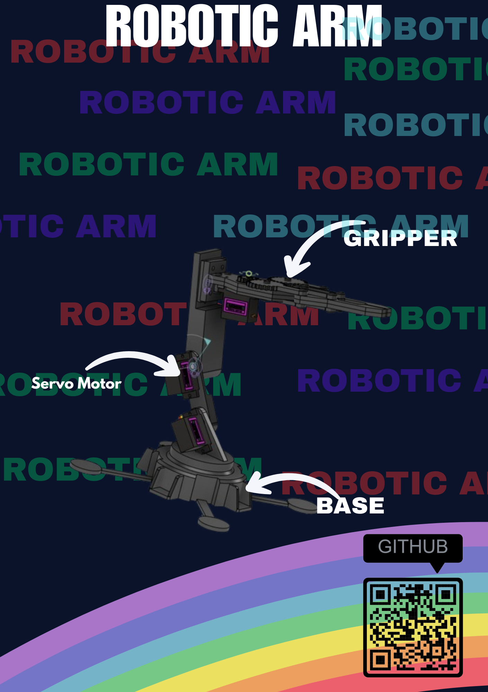

# Robotic Arm
This is a Simple Robotic arm created by me. It just uses 3 Servo Motors 1 one for gripper and 2 for the arm. This is just a Basic arm for now because I could not make good jaws right now and will improvise the robotic after on.

## Why
I created this project because it is cool and i wanted to make it one (Because I saw it in Iron man movies). I Built this Project to get to know about how structure and detailing in Fusion 360 can effect the full Project. I want to integrate in it later (just liek Iron man again) and amke it even cooler.

## Zine

## Required Hardware

Servo Motors X 3
Esp32 X 1
Battery X 1
Battery Charging Module X 1
Booster Module X 1
Bunch of Cables

## BOM (Bill of Materials)

| Name | Quantity | Total Cost (USD) | Link | Distributor |
|------|----------|------------------|------|-------------|
|ESP32| 1 | $4.00 | [Quartz](https://quartzcomponents.com/collections/all/products/esp32-30-pin-development-board-with-wi-fi-and-bluetooth) | Quartz Components |
| Servo Motor | 3 | $7.5 | [Quartz](https://quartzcomponents.com/products/mg995-metal-gear-servo-motor-180-degree-rotation) | Quartz Components |
| TP4056 | 1 | $0.2 | [Robu](https://robu.in/product/tp4056-1a-li-ion-battery-charging-board-micro-usb-with-current-protection-type-c-connector/) | Robu |
| Booster Module | 1 | $0.3 | [robu](https://robu.in/product/mt3608-2a-max-dc-dc-step-up-power-module-booster-power-module/) | Robu |